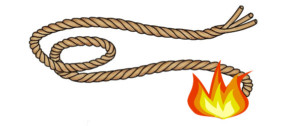

You have two pieces of rope, when one rope side is lit the rope will take one hour to burn, so burning each consecutively will take two hours to burn. Using the two ropes, how can you make it so you can use them to use it to time for 45 minutes (like an hour glass). 

* You are allowed to cut the ropes, but cutting the ropes in half does not guarantee that it will be half the time (such as attempting to cut the rope in half, but you actuality cut it 40/60). 

* Your tools are the lighter to light the rope, the two pieces of rope, and a knife if you did decide to cut it." 

  This question is a variation of a common interview question, if you have time, try to wrap your brain around, but **do not google for the answer**. 

  

