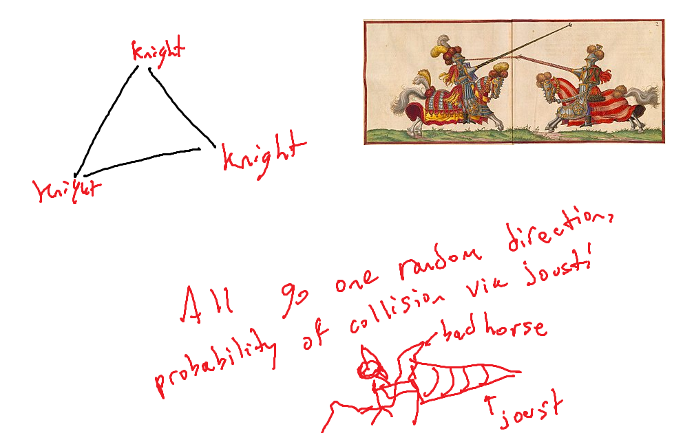

Three knights on gallant horses are on respective vertexes of a triangle aimed at one another. If each knight chose a random direction, what is the probability that any two knights joust and collide? 

